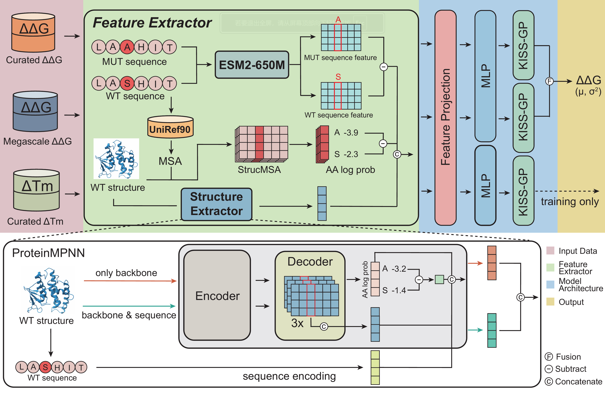

# STAB-DKL
multi-task fusion deep kernel learning for protein stability prediction and stabilizing mutations prioritization

For details on ThermoMPNN training and methodology, please see the accompanying [paper]().


# Table of Contents
- [Requirements](#requirements)
- [Installation](#installation)
- [Model Inference](#model-inference)
    - [Input Preparation](#input-preparation)
    - [Run Inference](#run-inference)
- [Model Training](#model-training)
- [Project Structure](#project-structure)
- [Citation](#citation)
- [Acknowledgements](#ccknowledgements)
- [License](#license)


# Requirements
### GPU Acceleration
STAB-DKL requires an NVIDIA GPU with CUDA support to run. 

### System Requirements
- GPU: NVIDIA GPU with CUDA 11.8+ support
- OS: Linux (Ubuntu 22.04 recommended)

# Installation
### 1. Install uv (Package Manager)  
uv will automatically download the required Python version (3.10) if needed.
```
curl -LsSf https://astral.sh/uv/install.sh | sh
source ~/.bashrc  # or ~/.zshrc if using zsh
```

### 2. Clone the Repository
```
git clone git@github.com:gumingmu/STAB-DKL.git
```

### 3. Install MMseqs2
STAB-DKL requires **MMseqs2** to perform multiple sequence alignment (MSA) searches for extracting evolutionary information.

We recommend installing the **GPU version** of MMseqs2 for the best performance. The precompiled release can be downloaded from the official MMseqs2 repository:

Download and extract the GPU package:

```bash
wget https://github.com/soedinglab/MMseqs2/releases/download/18-8cc5c/mmseqs-linux-gpu.tar.gz

tar -xvzf mmseqs-linux-gpu.tar.gz
```

> **Recommended:** We strongly recommend using the GPU version (`mmseqs-linux-gpu.tar.gz`) to achieve the fastest MSA search speed.

> **Note:** STAB-DKL also supports the CPU version of MMseqs2, although sequence search may be substantially slower.

### 4. Download UniRef90 Database
STAB-DKL requires the **UniRef90** database to perform MSA searches and extract evolutionary information.

Download the UniRef90 database
```bash
wget https://storage.googleapis.com/alphafold-databases/v3.0/uniref90_2022_05.fa.gz
gunzip uniref90_2022_05.fa.gz
```

Create index for Uniref90
```
# gpu version
mmseqs createdb uniref90_2022_05.fa uniref90_DB
mmseqs makepaddedseqdb uniref90_DB uniref90_DB_gpu
mmseqs rmdb uniref90_DB
mmseqs createindex uniref90_DB_gpu tmp --index-subset 2

# cpu version
mmseqs createdb ../../uniref/uniref90_2022_05.fa uniref90_DB
mmseqs createindex uniref90_DB tmp
```

> **Note:** The UniRef90 database is large and may require substantial disk space.

> **Important:** STAB-DKL currently expects the database version `uniref90_2022_05.fa` to ensure reproducibility and compatibility.

### 5. Download model weights
Pretrained model weights are available from Zenodo:

Download and extract the files from Zenodo into the corresponding directories.

### 6. Set Up the Python Environment
From the STAB-DKL directory, run:
```
uv sync
```
Then activate the environment
```
source .venv/bin/activate
```

### 7. Download Features for Reproducing Model Training (Optional)
Precomputed training features used for model development are available on Zenodo: http.  
This step is **optional** and is only required if you want to **reproduce model training**.  
For standard inference and prediction tasks, downloading these features is **not necessary**.
After downloading, place the extracted directory under:

```txt
data/
# Extract files
tar zxvf features.tar.gz 
```

# Model Inference
## Input Preparation

Before running inference, input PDB structures and mutation input files must be prepared properly.

### Prepare PDB Structure

The input PDB structure must satisfy specific formatting requirements to ensure successful feature extraction.

The input PDB structure must satisfy **all** of the following conditions:

1. The structure must contain **only the 20 standard amino acids**.
2. Residue numbering must:
   - **start from 1**
   - be **continuous without gaps**

We strongly recommend using a structure containing **only one protein chain**, as multi-chain structures may potentially introduce unexpected issues during feature extraction or inference.  

To minimize potential formatting issues, we recommend using **predicted protein structures** (e.g., AlphaFold or other structure prediction methods) whenever appropriate. Predicted structures are often single-chain and well-formatted, which may help avoid issues related to residue numbering discontinuities or unsupported residues.

If the input PDB structure does not satisfy the above requirements, we recommend using the provided preprocessing script to generate a cleaned structure file.

Example:

```bash
python scripts/clean_pdb.py \
    --input_pdb example/1qg8.pdb \
    --chain A \
    --out_pdb example/1qg8_clean.pdb
```

The preprocessing script can:

- Keep only the specified chain and 20 standard amino acids
- Renumber residues to start from **1** and Fix discontinuous residue indexing

### Generate Saturation Mutation Input File

If the input structure satisfies the requirements above, STAB-DKL provides a script to automatically generate mutation input files for **site-specific saturation mutagenesis**.

The script generates all possible amino-acid substitutions at the specified residue position.

Example:

```bash
python scripts/generate_mutation_file.py \
    --pdb_file example/1qg8_clean.pdb \
    --chain A \
    --seq_id 1qg8_a \
    --pos_limit 10-20 \
    --out_file example/1qg8_mutations_10-20.csv
```

| Argument | Required | Description |
|---|---:|---|
| `--pdb_file` | Yes | Path to the input PDB structure file. The structure should satisfy the formatting requirements described above. |
| `--chain` | Yes | Chain identifier to process.|
| `--seq_id` | Yes | Sequence identifier used in the output mutation file. This can be any user-defined name|
| `--pos_limit` | No | Residue positions to include for saturation mutagenesis. Supports a position range (e.g., `10-20`). If not provided, all valid residue positions in the structure will be included. |
| `--out_file` | Yes | Output path of the generated mutation input file. |


### Custom Mutation Input File

Alternatively, users can provide a custom mutation input file instead of using the provided mutation generation script.  
The input file must contain mutation information in a tabular format (CSV/TSV) with required columns following the specifications below.

#### Required columns

| Column | Description |
|---|---|
| `chain` | Chain identifier in the structure. |
| `position` | Mutation position. |
| `wtAA` | Wild-type amino acid at the mutation position. |
| `mutAA` | Mutant amino acid at the mutation position.. |
| `wt_seq` | Full wild-type protein sequence. |
| `mut_seq` | Full mutated protein sequence. |

#### Sequence identifier (at least one required)

At least **one** of the following columns must be provided:

| Column | Description |
|---|---|
| `seq_id` | User-defined sequence identifier used in the output. |
| `pdb` | Structure identifier (does not need to be an official PDB ID). If provided, `seq_id` will be automatically generated as `pdb_chain` (e.g., `1qg8 A` → `1qg8_A`). |

#### Structure file specification

| Column | Description |
|---|---|
| `pdb_file` | Path to the PDB structure file. Optional. |

If `pdb_file` is not provided, users must specify `--pdb_dir` during inference.

STAB-DKL will automatically search for the structure file using:

```text
{pdb_dir}/{seq_id}.lower()_model.pdb
```

## Run Inference

After preparing the input structure and mutation input file, predictions can be generated using the following command:

### Option 1: Use `pdb_dir`
If the input mutation file does **not** contain a `pdb_file` column, users should provide `--pdb_dir`.

Example:

```bash
python -u predict_pipeline.py \
    --input data/test/p53_tr_d.csv \
    --output results/predictions.csv \
    --pdb_dir data/af3_pdb/ \
    --model_path vanilla_model_weights/model.pt \
    --data_path vanilla_model_weights/data.pt \
    --trainer_config vanilla_model_weights/trainer_config.pt \
    --esm2_path facebook/esm2_t33_650M_UR50D \
    --mmseqs_cmd /path/to/mmseqs/bin/mmseqs \
    --mmseqs_db /path/to/uniref90_DB_gpu \
    --device cuda:0
    --batch_size 1024
```

### Option 2: Use `pdb_file` Column
If the input mutation file already contains a `pdb_file` column, `--pdb_dir` is **not required**.

```bash
python -u predict_pipeline.py \
    --input example/1qg8_mutations_10-20.csv \
    --output example/1qg8_mutations_10-20_pred.csv \
    --model_path vanilla_model_weights/model.pt \
    --data_path vanilla_model_weights/data.pt \
    --trainer_config vanilla_model_weights/trainer_config.pt \
    --esm2_path facebook/esm2_t33_650M_UR50D \
    --mmseqs_cmd /path/to/mmseqs/bin/mmseqs \
    --mmseqs_db /path/to/uniref90_DB_gpu \
    --device cuda:0
    --batch_size 1024
```

### Argument Description

#### Input / Output

| Argument | Required | Description |
|---|---:|---|
| `--input` | Yes | Input mutation CSV file. The file format should follow the requirements described in **Mutation Input File Format**. |
| `--output` | Yes | Output CSV file path for prediction results. |
| `--pdb_dir` | No | Directory containing PDB structure files. Optional if the `pdb_file` column exists in the input mutation file. If `pdb_file` is not provided, STAB-DKL will automatically search for structures as `{pdb_dir}/{seq_id}.lower()_model.pdb`. |
| `--msa_file` | No | Path to an existing A3M MSA file. If not provided, STAB-DKL will automatically generate MSA file using MMseqs2. |

#### Model Files

| Argument | Required | Description |
|---|---:|---|
| `--model_path` | Yes | Path to the trained STAB-DKL model weights (`model.pt`). |
| `--data_path` | Yes | Path to the saved training features (`data.pt`). |
| `--trainer_config` | Yes | Path to the saved training configuration (`trainer_config.pt`). |

#### Protein Language Model

| Argument | Required | Description |
|---|---:|---|
| `--esm2_path` | Yes | Path to a local ESM2 model directory or a Hugging Face model name (e.g., `facebook/esm2_t33_650M_UR50D`). |

#### MSA Generation

These parameters are only required if `--msa_file` is **not provided**.

| Argument | Required | Description |
|---|---:|---|
| `--mmseqs_cmd` | No | Path to the MMseqs2 executable. Default: `mmseqs`. |
| `--mmseqs_db` | Conditional | Path to the MMseqs2 UniRef90 database. Required if `--msa_file` is not provided. |
| `--use_gpu` | No | Use GPU acceleration for MMseqs2 MSA generation. Enabled by default. |
| `--max_seqs` | No | Maximum number of sequences retained in the MSA. Default: `1000`. |
| `--threads` | No | Number of CPU threads used for MSA generation. Default: `22`. |

#### Feature Extraction

| Argument | Required | Description |
|---|---:|---|
| `--n_jobs` | No | Number of parallel jobs used for feature extraction. Default: `22`. |

#### Chain Handling

| Argument | Required | Description |
|---|---:|---|
| `--force_chain_A` | No | Force all chain identifiers to `A`. |

#### Inference Settings

| Argument | Required | Description |
|---|---:|---|
| `--device` | No | Device used for inference. Example: `cuda:0` or `cpu`. Default: `cuda:0`. |
| `--batch_size` | No | Batch size used during inference. Default: `1024`. |

# Model Training

This section is intended for users who want to **reproduce the STAB-DKL training process**.

Before training, please make sure that the **Features** have been downloaded.

Training can be reproduced using:

```bash
python -u train.py --config config/train.yaml
```

### Configuration File

Training settings are controlled through a YAML configuration file.

Example:

```text
config/train.yaml
```

# Project Structure

The repository is organized as follows:

```text
STAB-DKL/
├── data/                    # Mutation and structure files for train/val/test sets
├── config/                  # YAML configs for feature extraction and training
├── dataset/                 # Dataset classes
├── model/                   # Model architecture
├── feature_extraction/      # Feature extraction modules
├── example/                 # Example input/output files
├── paper_resources/         # Test-set predictions used in the manuscript
├── scripts/                 # Utility scripts
├── vanilla_model_weights/   # Pretrained model weights

├── prepareData.py           # Prepare sequences, structures, and datasets
├── data_augment.py          # TP/TR augmentation and sampling
├── get_features.py          # Feature extraction for datasets
├── predict_pipeline.py      # Inference pipeline
├── train.py                 # Training pipeline
└── README.md
```

# Citation
If you use STAB-DKL in your research, please cite:

# Acknowledgements

STAB-DKL builds upon several excellent open-source tools and resources.

- **ProteinMPNN** was used for extracting structure-related features.  
  We include relevant components of ProteinMPNN in this repository for convenience.

- **ESM2** was used to extract protein language model representations.

- **MMseqs2** was used for MSA generation.

We thank the authors of these tools for making their work publicly available.

If you use STAB-DKL, please also consider citing the corresponding original works.

### Related Resources

- ProteinMPNN: https://github.com/dauparas/ProteinMPNN
- ESM2: https://github.com/facebookresearch/esm
- MMseqs2: https://github.com/soedinglab/MMseqs2

# License

This project is licensed under the MIT License. See the `LICENSE` file for details.
